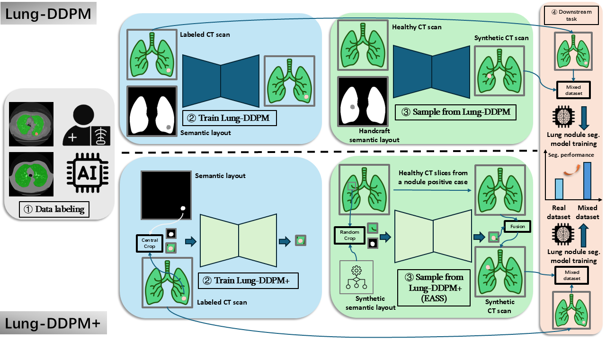
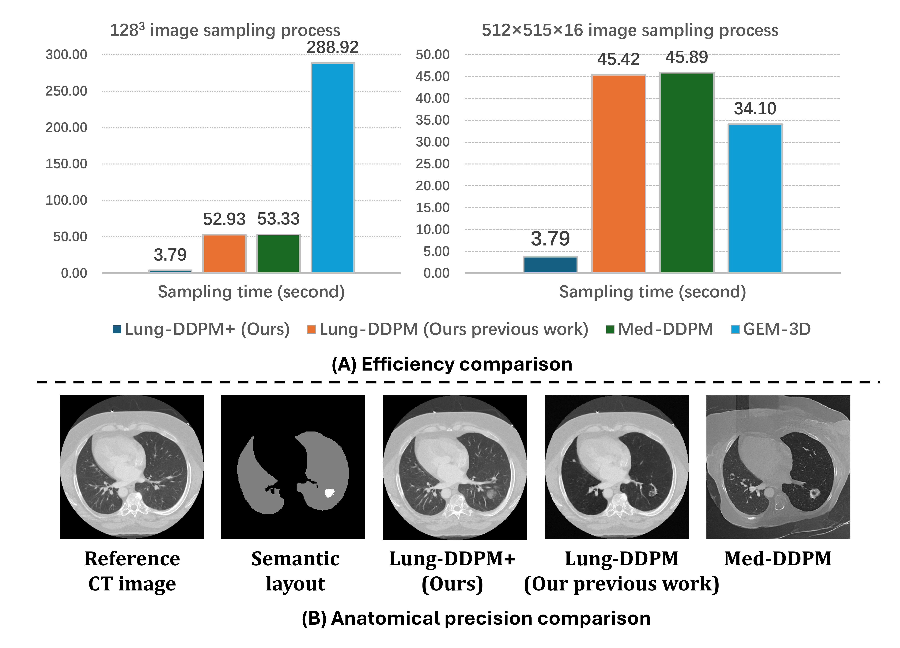

<!-- #region -->
# Lung-DDPM+: Efficient Thoracic CT Image Synthesis using Diffusion Probabilistic Model



[[Preprint article](https://www.arxiv.org/abs/2508.09327)] [[Dataset & Pretrained models](https://drive.google.com/drive/folders/1fV2RodOtF96WhcCF4wFc8DumL79Hup4-?usp=sharing)]

## Abstract
Generative artificial intelligence (AI) has been playing an important role in various domains. Leveraging its high capability to generate high-fidelity and diverse synthetic data, generative AI is widely applied in diagnostic tasks, such as lung cancer diagnosis using computed tomography (CT). However, existing generative models for lung cancer diagnosis suffer from low efficiency and anatomical imprecision, which limit their clinical applicability. To address these drawbacks, we propose Lung-DDPM+, an improved version of our previous model, Lung-DDPM. This novel approach is a denoising diffusion probabilistic model (DDPM) guided by nodule semantic layouts and accelerated by a pulmonary DPM-solver, enabling the method to focus on lesion areas while achieving a better trade-off between sampling efficiency and quality. Evaluation results on the public LIDC-IDRI dataset suggest that the proposed method achieves $8\times$ fewer FLOPs (floating point operations per second), $6.8\times$ lower GPU memory consumption, and $14\times$ faster sampling compared to Lung-DDPM. Moreover, it maintains comparable sample quality to both Lung-DDPM and other state-of-the-art (SOTA) generative models in two downstream segmentation tasks. We also conducted a Visual Turing Test by an experienced radiologist, showing the advanced quality and fidelity of synthetic samples generated by the proposed method. These experimental results demonstrate that Lung-DDPM+ can effectively generate high-quality thoracic CT images with lung nodules, highlighting its potential for broader applications, such as general tumor synthesis and lesion generation in medical imaging. 

## Demonstration



## Installation
```
git clone https://github.com/Manem-Lab/Lung-DDPM-PLUS
cd Lung-DDPM-PLUS
conda create -n lung-ddpm+ python=3.11
conda activate lung-ddpm+
pip install torch==2.7.1 torchvision==0.22.1 torchaudio==2.7.1 --index-url https://download.pytorch.org/whl/cu126
pip install -r requirements.txt
```

## Preparation
Download the processed dataset and pretrained models from the [Google Drive link](https://drive.google.com/drive/folders/1fV2RodOtF96WhcCF4wFc8DumL79Hup4-?usp=sharing) and extract them to the root folder to match the following directory structure:
```
Lung-DDPM-PLUS/
│── datasets/
│   ├── LIDC-IDRI/    # Prepared dataset
│   │   ├── CT/
│   │   │   ├── LIDC-IDRI-0003.nii.gz
            ...
│   │   ├── SEG_ALL/
│   │   │   ├── LIDC-IDRI-0003.nii.gz
            ...
│   │   ├── SEG_NODULE/
│   │   │   ├── LIDC-IDRI-0003.nii.gz
            ...
│   │   ├── evaluation/
            ...
│── checkpoints/      # Pretrained models
│   ├── best_model.pt
│── train.py
│── sample.py
│── README.md
...
```

## Training 
```
python train.py --ct_path datasets/LIDC-IDRI/CT --mask_path datasets/LIDC-IDRI/SEG_NODULE/ --save_and_sample_every 10000
```
The trained model and intermediate results are saved to `./results`.

## 3D Sampling
```
python sample.py --task 3D --maskfolder "datasets/LIDC-IDRI/evaluation/3D/SEG" --samplefolder "datasets/results/Lung-DDPM+/3D/CT" --samplemaskfolder "datasets/results/Lung-DDPM+/3D/SEG" --ctfolder "datasets/LIDC-IDRI/CT" --batchsize 1 --input_size 64 --depth_size 64 --num_channels 64 --num_res_blocks 1 --timesteps 250 --mix_from 250 --num_class_labels 2 --checkpointfolder "checkpoints" --bboxjson "datasets/LIDC-IDRI/evaluation/3D/bboxes.json" --sample_num 10 --visfolder "datasets/results/Lung-DDPM+/3D/VIS"
```
## 2D Sampling
```
python sample.py --task 2D --maskfolder "datasets/LIDC-IDRI/evaluation/2D/SEG" --samplefolder "datasets/results/Lung-DDPM+/2D/CT" --samplemaskfolder "datasets/results/Lung-DDPM+/2D/SEG" --ctfolder "datasets/LIDC-IDRI/CT" --batchsize 1 --input_size 64 --depth_size 64 --num_channels 64 --num_res_blocks 1 --timesteps 250 --mix_from 250 --num_class_labels 2 --checkpointfolder "checkpoints" --bboxjson "datasets/LIDC-IDRI/evaluation/2D/bboxes.json" --sample_num 10 --visfolder "datasets/results/Lung-DDPM+/2D/VIS"
```

## Citation
If Lung-DDPM+ contributes to your research, please cite as follows:
```
@article{jiang2025lung,
  title={Lung-DDPM+: Efficient Thoracic CT Image Synthesis using Diffusion Probabilistic Model},
  author={Jiang, Yifan and Shariftabrizi, Ahmad and Manem, Venkata SK},
  journal={arXiv preprint arXiv:2508.09327},
  year={2025}
}
```

## Acknowledgements
Lung-DDPM+ is developed based on the following code repositories:
1. [denoising-diffusion-pytorch](https://github.com/lucidrains/denoising-diffusion-pytorch)
2. [guided-diffusion](https://github.com/openai/guided-diffusion)
3. [Med-DDPM](https://github.com/mobaidoctor/med-ddpm)
4. [DPM-Solver++](https://github.com/LuChengTHU/dpm-solver)
5. [MedSegDiff](https://github.com/SuperMedIntel/MedSegDiff)

We are very grateful for their contributions to the community.

